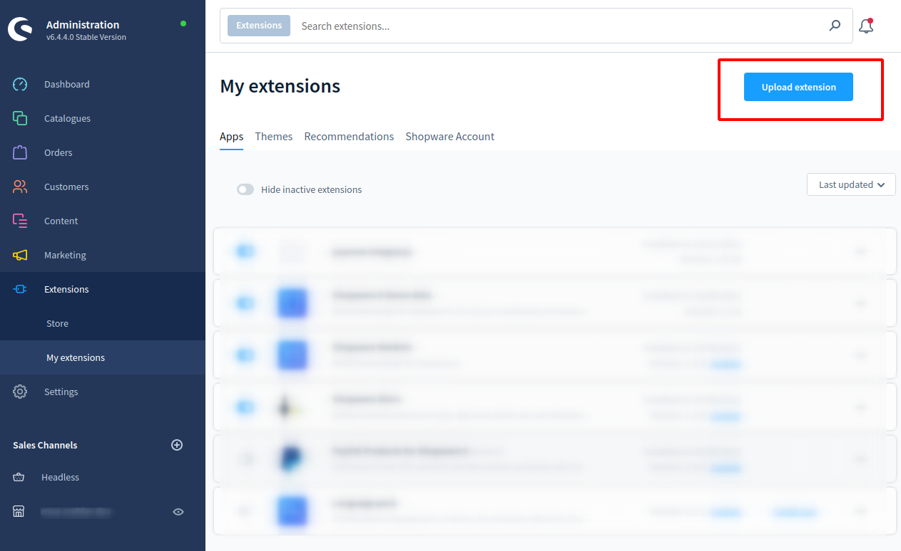
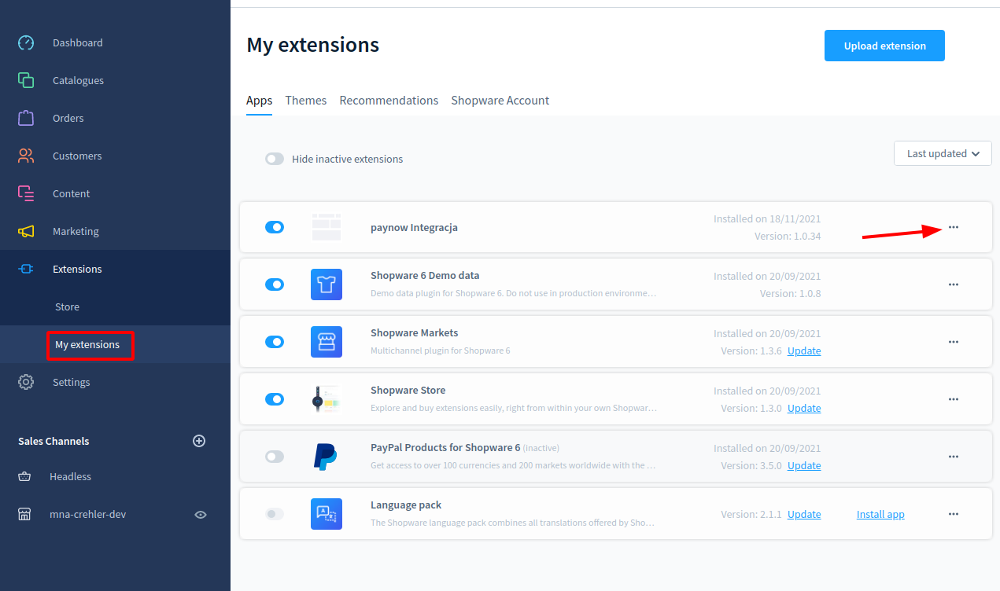
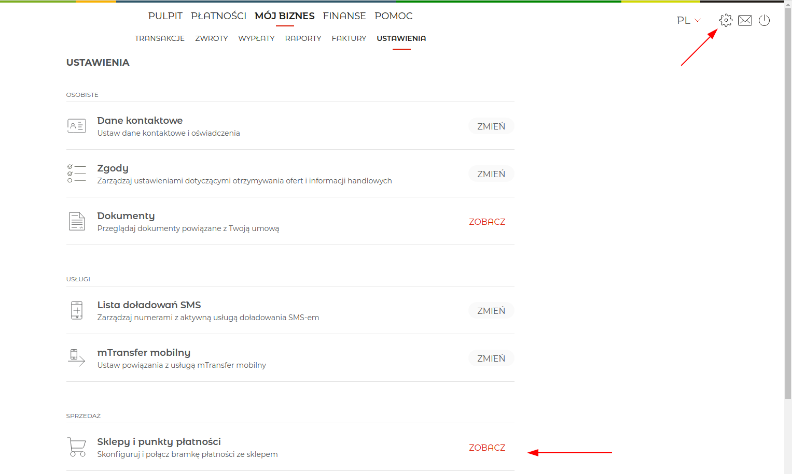
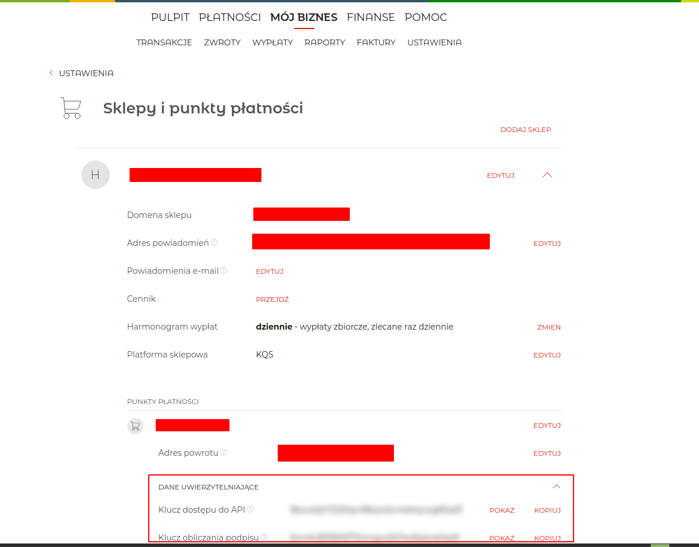
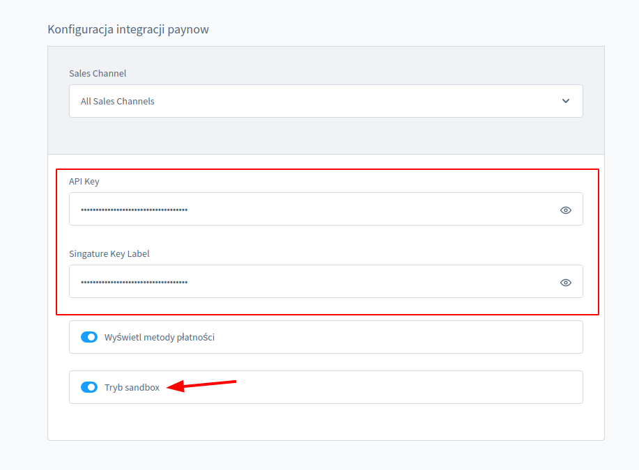
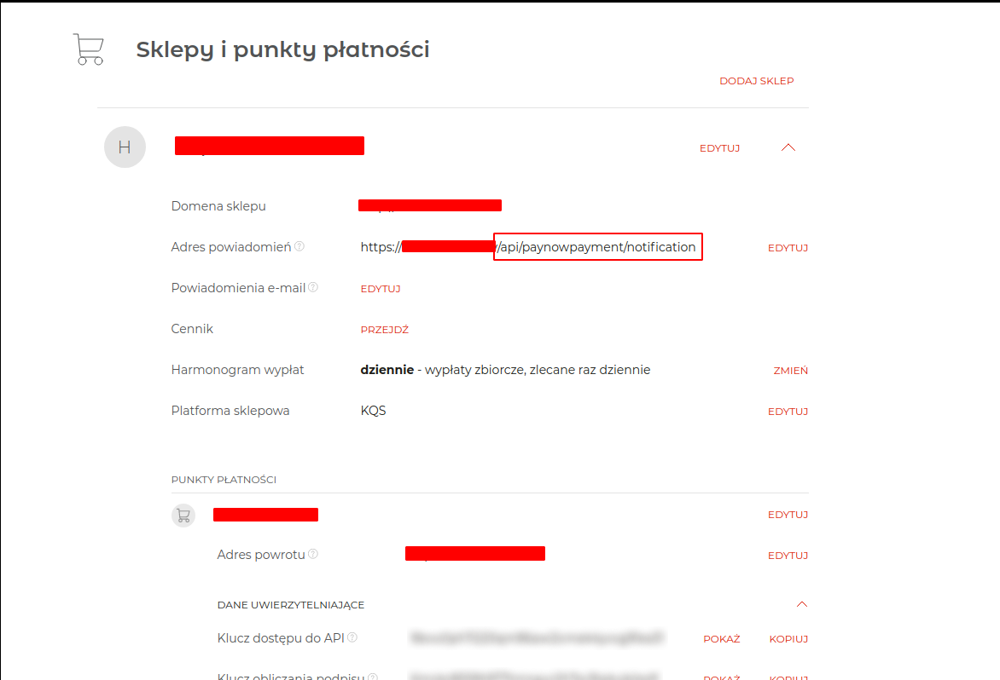
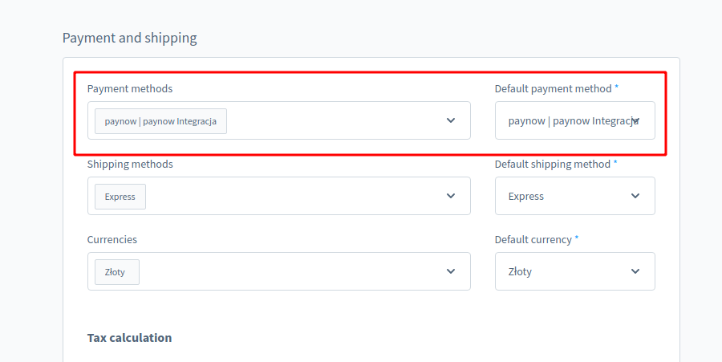

# Wtyczka Paynow dla Shopware 6

Wtyczka Paynow dodaje szybkie płatności i płatności BLIK do sklepu na Shopware 6.

## Spis treści
* [Wymagania](#wymgania)
* [Instalacja](#instalacja)
* [Konfiguracja](#konfiguracja)
* [Sandbox](#sandbox)
* [Wsparcie](#wsparcie)
* [Licencja](#licencja)

## Wymgania
- PHP od wersji 8.1
- Shopware w wersji 6.5.*

## Instalacja
#### 1. Przejdź do strony administracyjnej sklepu
#### 2. Przejdź do zakładki  **Extensions > MyExtensions** i wybierz   **upload extension**

## Konfiguracja
#### 1. Przejdź do  **Extensions > MyExtensions > PayNowIntegracja > CLICK ON "..."" > Configuration**.

#### 2. Skopiuj ze strony **https://panel.sandbox.paynow.pl/ > Ustawienia > Sklepy i punkty płatności:**   **"Klucz dostępu do API" oraz "Klucz obliczania podpisu"**

#### 3. Wklej skopiowane dane: **"Klucz dostępu do API"** do pozycji **"API-key"** oraz **"Klucz obliczania podpisu"** do **"Singature Key Label"**
##### Ważne - jeżeli korzystasz z otoczenia testowego wybierz tryb sandbox.

#### 4. Na stronie: **https://panel.sandbox.paynow.pl/ > Ustawienia > Sklepy i punkty płatności** znajdź pozycję Adres powiadomień i wklej adres swojej strony z końcówką:  "/store-api/paynowpayment/notification". Przykład:  **https://twoja-strona.pl/store-api/paynowpayment/notification**

#### 5. Aby upewnić się że metoda płatności jest dostępna, wejdź do Kanału sprzedaży, znajdź kartę odpowiedzialną za dostawę i płatności oraz wybierz:

## Sandbox
W celu przetestowania działania bramki Paynow zapraszamy do skorzystania z naszego środowiska testowego. W tym celu zarejestruj się na stronie: [panel.sandbox.paynow.pl][ext2].

## Wsparcie
Jeśli masz jakiekolwiek pytania lub problemy, skontaktuj się z naszym wsparciem technicznym: support@paynow.pl.

Jeśli chciałbyś dowiedzieć się więcej o bramce płatności Paynow odwiedź naszą stronę: https://www.paynow.pl/.

## Licencja
Licencja MIT. Szczegółowe informacje znajdziesz w pliku LICENSE.

[ext0]: README.EN.md
[ext1]: https://bitbucket.org/crehlerteam/paynowpayment/src/master/
[ext2]: https://panel.sandbox.paynow.pl/auth/register
